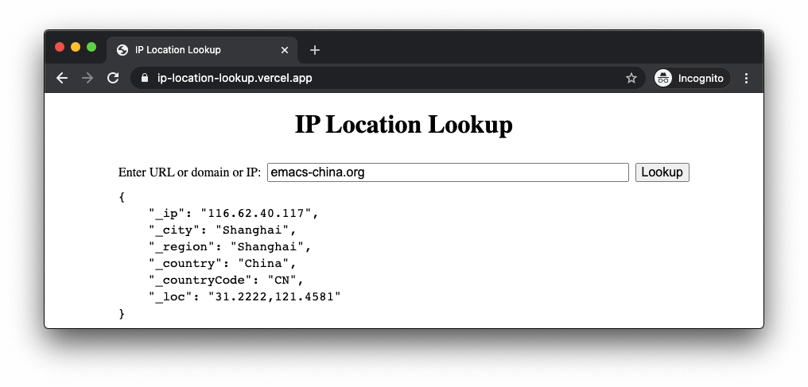

# IP Location Lookup

https://ip-location-lookup.vercel.app/



## API

The API endpoint is https://ip-location-lookup.vercel.app/api/ip, if the `q`
query parameter is omitted or empty, the request client's IP will be used,
otherwise `q` should be a URL or domain or IP address, such as
`https://emacs-china.org`, `emacs-china.org` and `116.62.40.117`. For example,

```
$ curl 'https://ip-location-lookup.vercel.app/api/ip?q=emacs-china.org'
{
    "_ip": "116.62.40.117",
    "_city": "Shanghai",
    "_region": "Shanghai",
    "_country": "China",
    "_countryCode": "CN",
    "_loc": "31.2222,121.4581"
}
```

The CORS HTTP header is added.

## Privacy

The IP data API is provided by <https://ipinfo.io/>. The website is hosting on
Vercel. I don't store logs.
